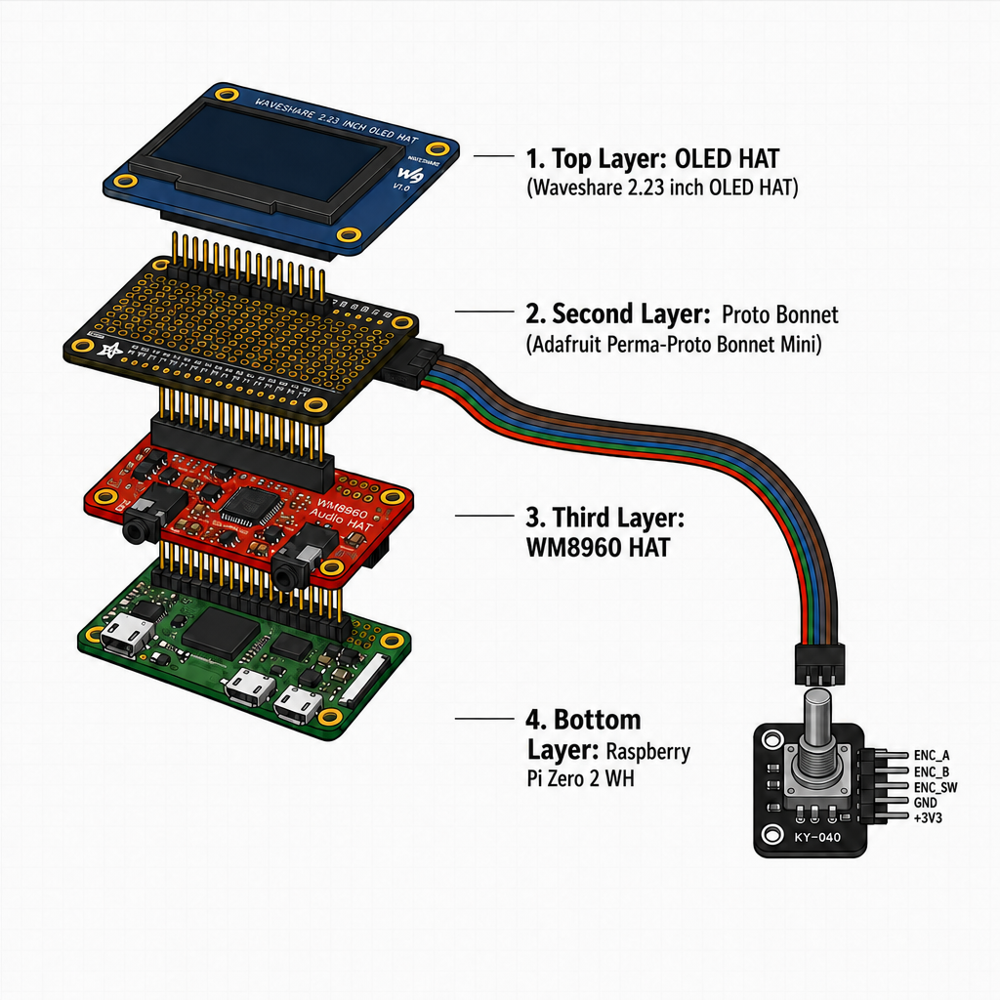

# microDX21 — Yamaha DX21 Emulator

A real-time FM synthesizer that runs the original **Yamaha DX21** voice/play engine on bare-metal **Raspberry Pi 3/4/5** (Circle stdlib, no Linux) and on **macOS/PC** for development. The synth core is the C-port of **Nuked OPM** (YM2164/OPP mode), giving a cycle-accurate YM2151-compatible FM engine with the DX21's voice architecture.

> **Status**: Synth engine, MIDI, SysEx, and play modes are stable. The UI is a minimal 128×32 SSD1305/SH1106 OLED + KY-040 rotary encoder; on-device parameter editing follows the original DX21's mode structure.

---

## What's in the box

### DX21 voice engine (`src/opm/`)
- **128 DX21 factory patches** as C++ data (full VCED parameter set: AR, D1R, D2R, RR, D1L, LS, RS, KVS, OUT, CRS, DET, AME, EBS, ALG, FB, LFO, PMS, AMS, key offset).
- **YM2164 (OPP) mode** — uses `opm_flags_ym2164` for authentic TL-ramping and per-AR plateau (AR=18–30) from `nuked-opp-xcent`.
- **Phase-reset disabled** for click-free KeyOn (the standard Nuked OPM `pg_phase=0` reset causes audible click on polyphonic note transitions; the OPP TL-ramp bit-7 of reg 0x60 covers the fade-in).
- **DAC mix-div / kScale** — gives 12 dB of headroom before the YM2151's 10-bit DAC, prevents hard clipping with 8 active voices at full output.
- **Lock-free SPSC MIDI ring buffer** between MIDI thread and audio ISR; SysEx goes through a deferred queue.
- **DX21-compatible SysEx real-time parameter change** (`F0 43 0n 12 pp vv F7`) for live editing of any VCED byte.
- **32-voice VCED bulk dump** import/export.
- **3-line modulated stereo ensemble/chorus** with 0.5 Hz + 3 Hz dual LFO, 120° phase offsets.
- **10 kHz Butterworth biquad** reconstruction filter on the DAC output.
- **Real-time pitch bend** via per-voice KC/KF updates, **portamento** via per-sample pitch interpolation, **breath controller** (CC#2), **mod wheel** (CC#1), **sustain** (CC#64).

### Play modes
- **SINGLE** — 8-voice polyphony, 1 patch
- **DUAL** — 4+4 voices, A/B balance
- **SPLIT** — 4+4 voices left/right of split point
- **MONO** — last-note-priority, legato, per side in SPLIT

### 32 Performance memories
Each stores: play mode, voice A/B, split point, balance, PB range, PB mode, portamento mode/rate, mod sensitivity, breath mappings, chorus, transpose, key shift, name. Save/load as JSON via the SD card; 32 RAM voice slots likewise.

---

## Hardware

### Target (Raspberry Pi bare-metal, Circle)
| Component | Required | Notes |
|---|---|---|
| Raspberry Pi 3, 4, or 5 | yes | bare-metal, no Linux |
| microSD card | yes | for boot firmware + config |
| USB-MIDI device (or USB host + MIDI keyboard) | yes | for Note input |
| I2S DAC **or** PWM audio out | yes | PCM5102A recommended for I2S |
| OLED display (SSD1306/SSD1305/SH1106, I2C or SPI) | optional | without it the synth still works (headless) |
| KY-040 rotary encoder | optional | for the new UI; without it use MIDI CC instead |

### microDX21 stack (Pi Zero 2 WH reference build)

The current default target. Four boards stacked through a single 2×20 GPIO header, top to bottom:

1. **Waveshare 2.23" OLED HAT** — SSD1305 / SH1106, 128×32 px, SPI or I2C, 3.3 V.
2. **Adafruit Perma-Proto Bonnet Mini (ADA3203)** — pass-through plus a 5-wire breakout (`ENC_A`, `ENC_B`, `ENC_SW`, `GND`, `+3V3`) for the encoder. No jacks, no encoder mounted on this board.
3. **WM8960 Hi-Fi Sound Card HAT** — I2S DAC, the only board carrying audio outputs (headphone / line out L+R, plus a speaker terminal block).
4. **Raspberry Pi Zero 2 WH** — BCM2710A1, 4× Cortex-A53 @ 1.0 GHz, 512 MB. The KY-040 encoder sits loose next to the stack, wired to the proto bonnet via the 5-wire ribbon only.



Pin numbers are not fixed — the stack is a *reference build*, not a wiring contract. See `config/microdx21.ini` for the current values. The KY-040's 5 wires (`ENC_A`, `ENC_B`, `ENC_SW`, `GND`, `+3V3`) terminate on the proto bonnet and can be remapped to any free GPIOs in software.

Current build (Pi Zero 2 WH):

| Encoder wire | Pi GPIO | Notes |
|---|---|---|
| `ENC_A` | GPIO5 | general purpose, no alt function |
| `ENC_B` | GPIO6 | general purpose, no alt function |
| `ENC_SW` | GPIO13 | button / switch input |
| `GND` | any GND pin | return |
| `+3V3` | any 3V3 pin | encoder VCC |

GPIO5/6/13 were chosen because they have no other assigned role on this build (no I2C, no SPI, no hardware PWM, no PCM/PLL), so the encoder is fully isolated from the I2S/I2C paths used by the WM8960 and the OLED.

> The schematic source (`doc/images/microdx21_stack_exploded.svg`) and the render prompt (`doc/images/microdx21_stack_exploded.prompt.md` + `.body.txt`) are checked in next to the PNG so the diagram can be re-rendered or edited.

### macOS dev host
- Apple Silicon (M1/M2/M3/M4) or Intel
- CMake 3.10+, SDL2, PortMidi (for `test/standalone.cpp`)
- ARM cross-toolchain (only for building the Pi image, not for `standalone`)

---

## UI

A minimal 128×32 SSD1305/SH1106 OLED + a single KY-040 rotary encoder. The display layout mirrors the original DX21's HD44780 2×16 character LCD, scaled to 128×32 pixels:

```
┌───────────────────────────────────────┐
│  EDIT  3/36                  (page 0) │  ← mode title + cursor
│   7                          (page 1) │  ← 7-seg big value (8×16)
│  FEEDBACK                    (page 2) │  ← parameter name
│  MEMORY PROTECTED            (page 3) │  ← status / unit
└───────────────────────────────────────┘
```

- **CDX21Display** (`src/display/display_dx21.{h,cpp}`) wraps `CSSD1305SPIDisplay` from `libdisplay2` and renders 5 modes (PLAY, EDIT, PERFORMANCE, FUNCTION, MEMORY) + a COMPARE overlay. Mode title on top row, 7-segment-style large value (8×16) in the middle, parameter name and status on the bottom two rows.
- **CDX21Input** (`src/display/dx21_input.{h,cpp}`) wraps the Circle sensor-addon's `CKY040` (ISR-driven, with switch debounce, single/double/triple-click, hold detection). The mapping:
  - rotate CW/CCW → next/prev parameter
  - single click → cycle mode (PLAY → EDIT → PERFORM → FUNCTION → MEMORY → PLAY)
  - double click → COMPARE toggle
  - long press → memory-protect toggle
- **Strings** are extracted from the original ROM V1.5 firmware (`src/opm/firmware/dx21_rom_v1_5.asm`): 36 EDIT-mode parameter labels, 46 FUNCTION-mode menu items, 6 PLAY labels, ON/OFF, note names, tape-dialog labels, MIDI status. All in `src/opm/dx21_ui_strings.h`.
- **7-segment font** (8×16, hand-coded segment-mask composition) in `src/opm/dx21_ui_7seg.h` evokes the original DX21's 7-segment LED look.

---

## Build

### macOS standalone (development, with audio + MIDI)
For working on the synth engine, MIDI handling, and SysEx without touching the Pi toolchain. Uses SDL2 for audio and PortMidi for MIDI I/O. This is what you use to iterate on `opmemu.cpp`.

```bash
cd microDX21
mkdir -p build && cd build
cmake ..
make
./standalone
```

Controls (in `standalone`):
| Key | Action |
|---|---|
| `s` / `d` / `p` | Play mode: Single / Dual / Split |
| `m` | Toggle Mono |
| `+` / `-` | Patch A next / prev |
| `a` / `b` | Patch B next / prev |
| `[` / `]` | Split point -1 / +1 |
| `<` / `>` | Balance -1 / +1 |
| `r` | Pitch bend range cycle |
| `o` | Portamento mode cycle |
| `O` / `P` | Portamento rate +5 / -5 |
| `t` / `T` | Master tune -1 / +1 cent |
| `e` | Toggle chorus |
| `0`–`9` | Apply performance memory 0–9 |
| `S` / `L` | Save/load RAM bank to/from `ram_bank/` |
| `q` | Quit |

### Raspberry Pi bare-metal image
Cross-compile the `kernel8.img` (Pi 3) / `kernel8-rpi4.img` (Pi 4) / `kernel_2712.img` (Pi 5) using the ARM GNU toolchain. The build script does the full thing: builds `libs/circle-stdlib`, the sensor + display add-ons, `libdisplay2`, and the synth.

```bash
# ARM toolchain expected at:
#   /usr/local/arm-gnu-toolchain-14.3.rel1-<host>-aarch64-none-elf/bin
# (Adjust build-mac.sh:62 if your path differs)

RPI=3 ./build.sh            # → out/kernel_rpi3.img
RPI=4 ./build.sh            # → out/kernel_rpi4.img
RPI=5 ./build.sh            # → out/kernel_rpi5.img

# Or, with the interactive script:
./build-mac.sh --rpi 3
```

The `RPI=1,2` builds use the 32-bit toolchain (`arm-none-eabi-`); `RPI=3,4,5` use the 64-bit one (`aarch64-none-elf-`).

#### What happens under the hood
1. `libs/circle-stdlib/configure` — produces `Config.mk` with the right `ARCH`, `RASPPI`, `CFLAGS_FOR_TARGET`.
2. `make -j` in `libs/circle-stdlib` — builds `libcircle.a`, `libsensor.a` (for CKY040), `libdisplay.a` (HD44780/SSD1306 chardev), `libfatfs.a`, `libusb.a`, etc.
3. `make` in `libs/circle-stdlib/libs/circle/addon/Properties` and `…/sensor` and `…/display` — builds the add-on archives.
4. `make` in `libs/libdisplay2` — builds the modern `libdisplay2.a` (CSSD1305SPIDisplay etc.) used by `CDX21Display`.
5. `make` in `src` — builds `microdx21` against everything, produces `kernel8.img`.

`src/Makefile` reads `CFLAGS_FOR_TARGET` from `Config.mk` (via `src/Rules.mk` → `libs/circle-stdlib/Config.mk`) and adds `-DAARCH=64 -mcpu=cortex-a53 -mlittle-endian -D__circle__ -DRASPPI=N -DREALTIME -DSAVE_VFP_REGS_ON_IRQ -DARM_ALLOW_MULTI_CORE` automatically.

#### Multi-core layout (Pi 3/4/5 with `ARM_ALLOW_MULTI_CORE`)
| Core | Role |
|---|---|
| 0 | USB Plug-and-Play poll, MIDI, audio DMA-IRQ consumer |
| 1 | Audio generation (fills the lock-free ringbuffer) |
| 2 | OLED render (~30 Hz) + encoder event drain |
| 3 | Deferred work: SysEx, preset load, file I/O |

The `m_audioPaused` atomic pauses DMA output during preset load so SD I/O doesn't corrupt the audio stream.

---

## Configuration (`config/microdx21.ini`)

Properties are read by `CConfig` at boot. Defaults are sensible; copy `config/microdx21.ini` to the boot partition of the SD card and edit. **Only the keys that the firmware actually reads are listed below** — every other key in the file is silently ignored.

### Audio
```ini
SoundDevice=i2s              # pwm | i2s | usb
SampleRate=48000
ChunkSize=256
DACI2CAddress=0              # 0 = on-board PWM, otherwise PCM5102A I2C addr
MasterVolume=32
```

### Display
```ini
# 128x32 SSD1305 SPI OLED on SPI0
DisplayType=ssd1305
DisplayBus=spi
DisplayWidth=128
DisplayHeight=32
DisplaySPIDCPin=24
DisplaySPIResetPin=25
DisplaySPISpeed=8000000

# SH1106 I2C 128x64 (alternative)
# DisplayType=sh1106
# DisplayBus=i2c
# DisplayI2CAddress=0x3C

# KY-040 rotary encoder (BCM pin numbers)
EncoderPinA=10               # CLK
EncoderPinB=9                # DT
EncoderPinBtn=11              # SW
```

## Flashing the Pi

```bash
# 1. Format SD card as FAT32 (single partition)
# 2. Copy Raspberry Pi boot firmware (bootcode.bin, start.elf, fixup.dat for Pi 3; or
#    the equivalent files for Pi 4/5 from the Raspberry Pi firmware repo)
# 3. Copy microDX21 kernel
sudo cp out/kernel_rpi3.img /boot/kernel_rpi3.img
# 4. Copy config
sudo cp config/config.txt /boot/config.txt
sudo cp config/cmdline.txt /boot/cmdline.txt
sudo cp config/microdx21.ini /boot/microdx21.ini
# 5. (Optional) Plug a USB-MIDI keyboard into the Pi's USB-A port
# 6. Boot, watch serial console at 115200 baud on GPIO14/15 (TX/RX)
```

A typical serial session looks like:
```
microDX21 starting...
Audio: i2s 48000Hz ChunkSize=256 DACAddr=0x00
Initializing cores...
System has 4 cores
128x32 SSD1305 SPI display ready (DC=24 RST=25 CS=0 @8000000 Hz)
KY-040 ready (CLK=17 DT=27 SW=22 mode=ISR detents=4)
Initialize OK
Core 0: MIDI + USB PnP
Core 1: Audio Generation
Core 2: Display + Encoder
Core 3: Deferred Work
```

---

## Source tree

```
src/
├── kernel.{h,cpp}             Bare-metal CKernel (multi-core launch, panic, core dispatch)
├── main.cpp                   C-style main() entry point
├── microdx21.{h,cpp}          CMicroDX21 — MIDI, presets, audio, SysEx
├── circle_stdlib_vk.h         StdlibApp base class (tty, log, file system, network)
├── common.h                   maplong/mapfloat/constrain helpers
│
├── audio/                     Audio backends (PWM, I2S, USB gadget)
│   ├── microdx21_pwm.{h,cpp}
│   ├── microdx21_i2s.{h,cpp}
│   ├── microdx21_usb.{h,cpp}
│   ├── microdx21_multicore.{h,cpp}     Core-1 audio producer, lockfree ringbuffer
│   └── opmemuadapter.h        DX21_Patch ↔ COPMEmu parameter adapter (for `Render()` to read live synth state)
│
├── midi/                      MIDI device drivers
│   ├── microdx21_mididevice.{h,cpp}
│   ├── microdx21_usbmididevice.{h,cpp}
│   ├── microdx21_serialmididevice.{h,cpp}  # DIN-MIDI on UART GPIO
│   └── microdx21_pckeyboard.{h,cpp}        # PC keyboard (debug only)
│
├── display/                   128x32 OLED + KY-040 UI
│   ├── display_dx21.{h,cpp}   CDX21Display: 5 DX21 modes rendered to 128x32 OLED
│   ├── dx21_input.{h,cpp}     CDX21Input: KY-040 → mode/param/compare state machine
│   └── displayconfig.h        DisplayConfig struct (pins, bus, controller)
│
├── opm/                       The synth engine itself
│   ├── opm.c                  Nuked OPM (cycle-accurate YM2151/YM2164 emulation)
│   ├── opm.h
│   ├── opmemu.{h,cpp}         DX21 voice management, MIDI handling, effects
│   ├── patches.h              128 DX21 factory voices
│   ├── memory/                RAM voices, performance memories, JSON+SysEx persistence
│   │   ├── dx21_memory.{h,cpp}
│   ├── io/                    Pluggable filesystem layer
│   │   ├── ifilesystem.h
│   │   ├── std_filesystem.h
│   │   └── fatfs_filesystem.h
│   ├── dx21_ui_strings.h      ROM-V1.5-extracted UI strings (EDIT/FUNCTION/TAPE/MIDI)
│   └── dx21_ui_7seg.h         8x16 7-segment font (digits, letters, symbols)
│
├── system/                    Boot configuration
│   ├── config.{h,cpp}
│   └── utility.h
│
├── util/ringbuffer.h          Lock-free SPSC ringbuffer
│
├── opm/firmware/
│   └── dx21_rom_v1_5.asm      Reverse-engineered ROM V1.5 (M6803 asm) — reference only
│
├── Synth_OPM.mk               Audio-engine-specific CFLAGS (-mcpu=cortex-a53, NEON, …)
├── display.mk                 Include path for circle/addon/display
├── sensor.mk                  Include path for circle/addon/sensor (CKY040)
├── Rules.mk                   Circle-stdlib LIBS+INCLUDES (re-includes Config.mk)
└── Makefile                   OBJS, CFLAGS_FOR_TARGET forwarding, opm.c special rule

config/
├── config.txt                 Pi boot config (kernel=…, arm_64bit=1, gpu_mem=16, …)
├── cmdline.txt                Kernel command line (usbspeed=full)
└── microdx21.ini              microDX21 application config (parsed by CConfig)
```

---

## Architecture decisions

### Audio thread safety
- No `new`/`delete` after `Initialize()`. No `std::vector` resize, no `std::string` mutation in the audio callback (`processBlock()`).
- `m_audioPaused` atomic gates DMA output during heavy operations (preset load, SysEx bulk import).
- MIDI queue is SPSC lock-free; SysEx is queued and processed on Core 3 / deferred thread.

### Display thread safety
- `CDX21Display::Render()` is single-threaded — only called from Core 2 in multi-core builds, only from Core 0 in single-core. Cached state (`m_bDirty`) avoids re-rendering the framebuffer.
- The `CKY040` event handler runs in GPIO-IRQ context but only mutates atomic-sized `int` parameters via `Set*()` methods; the actual `Render()` happens on Core 2.
- The display is purely text-based with no widget tree, style cache, or layout engine. `CDX21Display` is 543 lines, has zero heap allocation, and the entire framebuffer update is a 30 Hz `Clear() + 4 lines of text + 1 7-seg number + Show()` — total < 200 µs on a Pi 3. The 128×32 OLED's 1 KB framebuffer maps 1:1 to the original DX21's 2×16 character LCD.

### Strings from the ROM
The original DX21 firmware (`src/opm/firmware/dx21_rom_v1_5.asm`, 14 600 lines of M6803 assembler) was reversed to extract the LCD strings. The 6 modes (`PLAY/EDIT/PERFORMANCE/FUNCTION/MEMORY/COMPARE`) and their per-mode handlers are documented in `rtn_85`, `rtn_184` in that file. We deliberately *re-implement* the dispatch logic in `CDX21Input::ApplyEvent()` rather than emulate the M6803 — the goal is "looks and feels like a DX21", not 100% ROM-cycle equivalence.

---

## MIDI implementation notes

- **Channel filter** — `CMicroDX21::ShouldAcceptChannel()` filters channel-voice messages (notes, CC, PC, pitch bend) by the configured `MIDIChannel`. SysEx and system real-time (clock, start/stop/continue) always pass.
- **SysEx** is queued in a 2-slot buffer (up to 64 KB each) and processed in `ProcessDeferredSysEx()`. Real-time parameter change and bulk dump both supported.
- **Soft-thru** is unfiltered (forwards everything received on USB-MIDI to USB-MIDI out, useful for DAW setups).
- **Program Change** loads a patch into voice A; PC is not delayed.
- **Channel pressure / Poly aftertouch** are received but currently ignored (DX21 has no aftertouch).

---

## VCED → YM2151 register mapping

DX21 parameters don't map 1:1. Key conversions:

| DX21 | YM2151 | Notes |
|---|---|---|
| DET (0–6 = −3…+3) | DT1 | `{7,6,5,0,1,2,3}[det]` (negative half goes to DT1=5–7) |
| CRS (0–63) | MUL (0–15) | 4-step for MUL=0, 3-step for MUL=1–15, then flat at 15 |
| OUT (0–99) | TL | `tl = (99 - out) * 127 / 99` |
| D1L (0–15) | D1L | `15 - d1l` (DX21 inverts direction) |
| LS (0–99) | TL offset | per-note, scaled by `(note - 60)` |
| KVS (0–7) | TL offset | per-note velocity attenuation |
| ALG (0–7) | CON | direct |
| LFO SPEED (0–255) | `chip->lfo_freq` (via `OPM_SetLFOFrequency` 4-bit scaled) | 8-bit value mapped to 4-bit chip range |
| LFO WAVE | `chip->lfo_wave` | tri / saw up / square / s&h |
| AMD/PMD (0–127) | `chip->amd/pmd` | direct 7-bit |
| PMS/AMS (0–7 / 0–3) | `OPM_Channel*` PMS/AMS | 3-bit / 2-bit |
| LFO_SYNC | `OPM_KeyOn` re-trigger | key-on-time-reset LFO phase |

KC note-code mapping: only 12 of 16 nibble values are chromatic. C sits at the top of each chip octave (nibble 14), so the boundary is computed as `chip_oct = (midi - 1) / 12 - 1` and `chip_note = (midi - 1) % 12` → MIDI 60 = C4 → KC 0x3E (oct 3, nibble 14).

---

## License

- **microDX21 code** (`opmemu.cpp`, `patches.h`, `memory/`, `io/`, `display/`, `dx21_ui_*.h`, `kernel.cpp`, `audio/`, `midi/`, `system/`, `util/`) is released under the **MIT License**.
- **Nuked OPM** (`src/opm/opm.c`, `src/opm/opm.h`) by Nuke.YKT, **LGPL-2.1-or-later**.
- **nuked-opp-xcent** attack-rate-skip integration, **LGPL-2.1-or-later**.

LGPL compliance: when distributing binaries, either link Nuked OPM dynamically or provide object files for the relink right.

---

## Acknowledgements

- **Nuke.YKT** for the Nuked OPM/OPP core, die analysis by gtr3qq (siliconpr0n.org).
- **Knives On Strings** for the OPP AR-skip patch.
- **Circle** (by R. Stange) and the **circle-stdlib** project.
- **MiniDexed** and **picoX21H** for inspiration on DX21 emulation architecture and bare-metal FM synth deployment.

---

## Roadmap

- [x] Nuked OPM-based FM core
- [x] 128 factory patches
- [x] 32 RAM voice slots
- [x] DX21 SysEx (parameter change + bulk dump)
- [x] Play modes (Single/Dual/Split)
- [x] 32 performance memories (JSON)
- [x] Multi-core deployment (Pi 3/4/5)
- [x] New minimal UI (128×32 SSD1305/SH1106 + KY-040)
- [x] **Plug in the synth engine to the UI** — `CDX21Display::Render()` now reads live values from `COPMEmuAdapter` via `SetAdapter()`. PLAY/EDIT/PERFORMANCE/FUNCTION show voice name, play mode, and 7-seg parameter values; MEMORY shows bank name and tape label. 5 Hz refresh tick (`InvalidateIfStale(200)`) keeps MIDI-driven state changes visible.
- [x] **Power-on splash** — `CDX21Display::SetSplash(true)` + 2 s `CTimer::SimpleMsDelay` in `kernel.cpp::Initialize()`. Mirrors the original DX21 boot banner (`* YAMAHA DX21 *` / `* SYNTHESIZER *`) on the 128x32 OLED, with a big 7-seg "DX21" mark on page 1.
- [x] **Wire encoder rotation to live parameter changes** — `CDX21Display::AdjustValue(±1)` writes through `COPMEmuAdapter::setParameter()` for PLAY/PERFORMANCE (voice select via `kParamInstrument`), EDIT (raw VCED byte via `writeVcedGlobal/Operator`), and FUNCTION. Rotation in EDIT/FUNCTION is browse-vs-edit toggled by the first tick of `EventSwitchHold`; second tick still toggles MEMORY PROTECT. Status line shows `VAL=NNN` so the user sees the change.
- [x] **Complete VCED parameter coverage** — all 76 VCED bytes have live setters. The 36 EDIT-mode entries went from 14 live bindings to 26 (P MOD/A MOD/E BIAS/KEY VELOCITY/FREQUENCY/DETUNE/D2R/RR/RS/LS now wired to OP1). The 46 FUNCTION-mode entries went from 9 to 12 (Master Tune, Mono Mode, Fingered/Full Time/Foot Porta, BC ×3, Middle C, Bend Mode, Key Shift). `COPMEmuAdapter` enum grew to 78 entries (32 per-op extended params, plus 9 global non-VCED: PMS, AMS, KeyOffset, MasterTune, Mono, PBMode, Breath×4).
- [x] **Boot splash polish** — 4-step top-down fade-in (`* YAMAHA *` → `DX21` → `* SYNTHESIZER *` → `v0.1.0 INIT...`), one page every 250 ms, then 1 s hold before handing off to PLAY. `m_SplashProgress` is reset by `SetSplash(false)` so a re-entry (panic / restart) starts from the top.
- [x] **Tape save/load UI** — 3-stage MEMORY dialog: pick action (Save/Load/Verify) → confirm (YES/NO) → pick group (1..16) → result. Saves/loads 32 RAM voices per bank to `SD:/MICRODX21/BANK_NN/voice_*.json`. Encoder rotation navigates the dialog; click advances/executes. New `COPMEmuAdapter::MemoryResult` enum surfaces "OK / SAVE FAILED / NO SD CARD / VERIFY MISMATCH" in the status line for 2 s.
- [x] **USB-MIDI Gadget (removed)** — formerly a `CUSBMIDIGadget` branch in the kernel. Replaced by an external RP2350 "Comms" processor (pico-midi-adapter) that bridges USB-MIDI to UART RX/TX on GPIO 14/15. See `pico-midi-adapter/` for the firmware.
- [x] **DX21 FUNCTION-mode coverage (A2/A5/A6/A7/A8/A9/A10/B8/B9)** — A2 Dual Detune, A5 Transmit Ch, A6 CH Info, A7 Sys Info, A8 Bulk Transmit, A9 Edit Recall (snapshot via `m_editRecall`), A10 Init Voice (defaults to a single-carrier short-decay bell). B8 MW Pitch Range + B9 MW Amp Range now scale the CC#1 handler. UI action triggers via `CDX21Display::TriggerFunctionAction()` on click at `-1` entries.
- [x] **Panic / safe shutdown** — `CKernel::PanicHandler()` now: enables IRQs → calls `CMicroDX21::Panic()` (which runs `COPMEmu::resetEngine()` = KeyOff on all 8 channels + force every operator's TL to 127 + drop the MIDI/SysEx queues, then `CSoundBaseDevice::Cancel()` to stop the DMA) → calls `CDX21Display::Off()` → sets `m_bRunning = false` → parks in `wfi`. After this, the OPM is silent within one DMA buffer (~10 ms @ 48 kHz) and the OLED's charge pump is off. The graceful Run() exit also runs the same teardown so a future user-initiated shutdown gets it for free.

